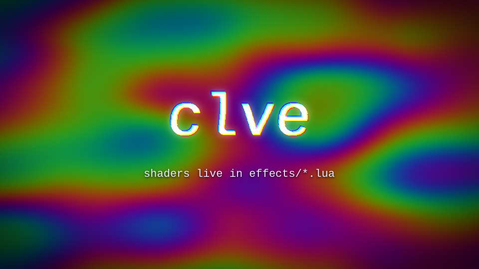

# Shader effects



<sub>A frame of [`examples/shaders`](../examples/shaders): the background is a
generated plasma, the title uses `wave`, `rgb_split` and the built-in `glow`.</sub>

An effect in `effects/` can carry a [WGSL](https://www.w3.org/TR/WGSL/) shader.
It runs on the GPU for every pixel of the layer, so it can do anything a
pixel can: distort, recolor, read neighbours, or ignore the layer and generate
an image of its own.

```
clve new effect wave --shader
```

```lua
-- effects/wave.lua
params = {
  amount = 12,  -- pixels
  freq = 3,     -- waves across the layer
}

margin = 16     -- room to draw outside the layer, in pixels

shader = [[
fn effect(uv: vec2f) -> vec4f {
  let px = p.amount * u.density / u.resolution.x;
  let shift = sin(uv.y * p.freq * 2.0 * PI + u.time * 4.0) * px;
  return sample(uv + vec2f(shift, 0.0));
}
]]
```

It is used like any other effect, and chains with them in call order:

```lua
function frame(t, layer)
  layer:effect("wave", { amount = 20 * fade_out(t, 0, 2) })
  layer:effect("glow")
end
```

## What the shader gets

`fn effect(uv: vec2f) -> vec4f` is called for every pixel. `uv` goes from 0 to
1 across the image, top-left to bottom-right; with a `margin`, that image is the
layer plus the margin on every side. Return the color with straight
(not premultiplied) alpha.

| name              | type    | meaning                                                  |
|-------------------|---------|----------------------------------------------------------|
| `p.<param>`       |         | your `params`: numbers are `f32`, `"#rrggbb"` colors are `vec4f`, `true`/`false` are `1.0`/`0.0` |
| `u.time`          | `f32`   | seconds since the layer started                          |
| `u.global_time`   | `f32`   | seconds on the timeline                                  |
| `u.frame`         | `f32`   | frame number on the timeline                             |
| `u.resolution`    | `vec2f` | size of the image in pixels                              |
| `u.size`          | `vec2f` | size of the layer in project pixels                      |
| `u.density`       | `f32`   | image pixels per project pixel (smaller in `--preview`)  |
| `u.margin`        | `f32`   | the margin, in image pixels                              |

Multiply lengths by `u.density` so a preview looks like the full render.

## Helpers

```wgsl
sample(uv)          // layer color at uv, transparent outside the image
pixel(xy)           // the same in pixels
luma(rgb)           // brightness
hash(v)             // 0..1, stable
noise(v)            // smooth noise, -1..1
rotate(v, degrees)
PI
```

## Lua and a shader together

An effect can have both `apply` and `shader`. `apply(t, layer, p)` runs first:
it can move the layer or compute parameters for the shader.

```lua
params = { amount = 6, angle = 0 }

function apply(t, layer, p)
  p.angle = p.angle + t * 90   -- the shader sees the rotated angle
end

shader = [[ ... uses p.angle ... ]]
```

## Errors

`clve check` compiles every shader, without a GPU, and points at the line in
the effect file:

```
error: [title] effects/wave.lua:14: can't multiply vec4f and vec3f
error: [title] effects/wave.lua:12: no definition in scope for identifier: `amout`
```

## GPU

clve uses [wgpu](https://wgpu.rs): Vulkan, Metal, DX12 or OpenGL, whichever the
system has. On a machine without a graphics card a software driver works too,
for example Mesa's lavapipe (`mesa-vulkan-drivers` on Debian and Ubuntu,
`media-libs/mesa` with the `vulkan` USE flag on Gentoo). Set `WGPU_BACKEND`
(`vulkan`, `gl`, `metal`, `dx12`) to pick one; the render prints which device
the shaders run on.

Consecutive shader effects on a layer run as one chain on the GPU: the image is
uploaded once and read back once.
